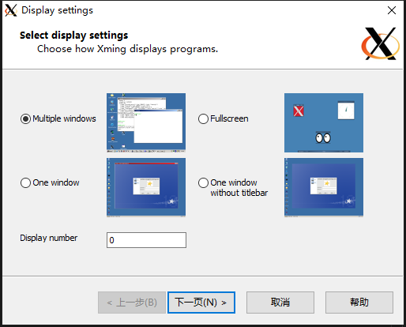
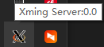
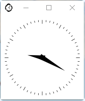

# GUI_Matlab_with_SSH

windows安装xming(https://sourceforge.net/projects/xming/)


只需要一路下一页。工作时只有一个小图标。



打开PowerShell，输入：
```bash
ssh -R 6002:127.0.0.1:6000 user@222.27.79.19
```
其中 -R 将远端6002端口映射到本地6000端口，user是用户名，222.27.79.19是被远程登录电脑的IP
登陆后输入
```bash
export DISPLAY=127.0.0.1:2.0
```
然后输入
```bash
xclock
```
就能看见  


然后输入
```bash
matlab
```
就🆗  

值得注意的是，DISPLAY环境变量将自动设置为:0:0
我们设置的DISPLAY=127.0.0.1:2.0中2.0的2和ssh中6002的2是同一个数字，具体可以搜索linux DISPLAY。
总之在实验室ssh能不用GUI就不要用，因为2.4gHz信号干扰太多，每天更换信道还是很卡