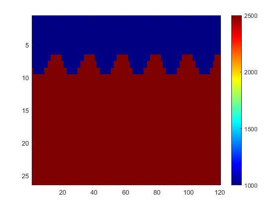

# <center>地震正演方法讨论</center>
<center> 张敞 2021622054</center>

## 前言
地球物理问题通常通过反演手段获得地下介质的物性参数，进而推断地下地质结构。正反演在实际工作中相辅相成，只有正演波场越接近实际波场，反演才能得到更准确的介质参数。地震反演中对于介质波速较为敏感，而对密度等信息不敏感。在基于波动方程的地震正演方法中，按照数学方法分类有有限差分方法和有限元方法。按照近似方程分类可以分成声波方程，弹性波方程，粘弹性方程等等。除了基础的数值计算方法外，物理约束的神经网络（Physics Informed Neural Network, PINN）也能够达到地震正演的目的，不过这种方法声称没有数值色散误差和方程近似带来的误差，但它巨大的计算量和可能有其他误差存在导致这种方法并不实用。除了关心正演方法的精度外，正演方法的计算效率也至关重要。如果一个正演方法速度有很大提升，则整个反演过程会节约大量时间（反传过程只要轻微改动），进而测试更多模型，解决更多实际问题。本文列举一些速度模型分别在声波方程和弹性波方程下的有限差分正演结果，PINN正演模拟结果以及实用技术带来的正演效率提升。
## 模型正演结果
如图一所示为一个常规二维速度模型，速度从1000m/s变化到2500m/s。模型大小为26*120m。

图一：纵波速度模型

正演过程中，为了满足稳定性条件： 
$$dx <  \frac{\min v}{f*12} $$
其中$f$为雷克子波主频，$\min  v$为模型中的最小速度，在主频为30Hz的情况下一个网格最大代表2.78m的实际距离。这里采用1m间距的网格点，因此网格大小为26*120。除了空间网格要满足稳定性条件防止色散误差外，时间步长也要满足稳定性条件：$$dt< \frac{dx}{2\times \max v} $$
这里采用$dt=2e-4$。使用22阶有限差分进行计算，得到的单炮记录如图二所示：
  
图二：声波方程单炮记录。
图中能看到两个速度界面间的起伏产生的反射波，初至波以及由于边界产生的一些散射。 

对于弹性波方程，与声波方程不同之处在于弹性波方程正演需要输入横波速度$vs$如图三所示：
  
图三：横波速度模型。
如图所示，横波速度与纵波速度保持了恒定的泊松比，横波速度根据经验公式$vp=1.732 \times vs$计算。  
弹性波计算通常采用交错网格的有限差分方法，将应力与速度分成两套网格，每次迭代依次计算应力与速度，能够达到更高的计算精度。因此在震源的设置上可以将子波添加到速度或者应力分量。基于弹性波方程得到的垂直分量CSG如图四所示：
  
图四：弹性波CSG垂直分量。
图中能够看到由于自由边界产生的面波，界面反射产生的反射波，以及初至波等等。

## PINN 正演模拟
在地震或雷达中PINN通常用一个全连接神经网络直接输出波形振幅相对于空间位置和时间的映射关系，在此基础上利用神经网络框架（如Tensorflow或Pytorch）的自动微分功能使映射关系满足要模拟波场的物理关系，如边值条件，波动方程等等。PINN的网络结构如图五所示：

图五：PINN网络结构示意图。
在X，Z分量输入波形的空间位置，t输入对应时刻，就能得到波形的振幅。现今各种神经网络框架都基于计算图进行正反传计算，计算图会自动记录每个计算节点，如果求输出关于输入的导数就会得到：
$$
\begin{bmatrix}
  \frac{\partial \phi }{\partial x} &\frac{\partial \phi }{\partial z}  & \frac{\partial \phi }{\partial t}\\ \\
  \frac{\partial \phi }{\partial x} &\frac{\partial \phi }{\partial z}  & \frac{\partial \phi }{\partial t}\\ \vdots& \vdots & \vdots\\
 \frac{\partial \phi }{\partial x} &\frac{\partial \phi }{\partial z}  & \frac{\partial \phi }{\partial t}\\
\end{bmatrix}.
$$
计算图能够符号化保存每个节点的计算步骤，因此很轻松能够计算出各个输出变量与输入变量间的导数关系，进一步将导数值作为约束条件添加到神经网络优化训练的目标函数中，也就达到了物理约束的目的。图六图七展示了一个PINN网络模拟的地震波在不同时刻下的波场快照和拟合曲线对比：


图六：PINN在t=0，0.015，0.15s的波场快照。


图七：PINN拟合曲线与输入数据的拟合情况。
由PINN的实现过程可知，PINN这种方法的确没有传统方法的误差。但PINN将物理条件作为约束添加到目标函数增加了训练过程中最优化问题的复杂度，增加了新的误差。此外，PINN的泛化能力也是瓶颈之一。例如在地震中，不同炮点的波场完全不同，只能用多个PINN或者设计更加复杂的网络结构，这进一步增加了PINN训练过程的复杂程度。训练网络通常采用数值方法作为训练样本，这也限制了PINN能达到的最大精度。

## 编程语言与计算效率
为了在最少的时间获取最多的性能，充分利用已有的API来获得更多的性能是一种合理的做法。Matlab是一种解释性语言，为了较好的用户交互而部分牺牲了速度上的优势，体现为循环的计算较慢。但Matlab对内置命令指令集级别的优化和矩阵计算的自动并行让其他语言难以望其项背。Eigen是一个免费的c++的矩阵运算库，有着清晰和直观的API，同样指令集级别的优化有着不输于Matlab的矩阵运算速度。MKL(Intel Math Kernel Library)是适用于Intel CPU的一个经过高度优化的，大量并行化的数学计算库。Matlab内置了MKL：
```matlab
version -lapack
ans =

    'Intel(R) Math Kernel Library Version 2019.0.3 Product Build 20190125 for
     Intel(R) 64 architecture applications, CNR branch AVX512_E1, supporting 
     Linear Algebra PACKage (LAPACK 3.7.0)'
```
可以看到启动了每个时钟周期内可以打包32次双精度和64次单精度浮点运算的AVX512指令集。而Eigen可以启动MKL作为后端对特定区间大小矩阵获得更高的计算效率：
```c++
#define EIGEN_USE_MKL_ALL
```
因此，将有限差分中复杂的矩阵计算交给Eigen，整体利用Maltab框架，就能最大程度的兼顾交互性和计算效率。表一为使用Matlab与使用c++ Eigen MKL多次有限差分正演的时间消耗对比。
| 网格大小     | Mex单精度(s) | Mex双精度(s) |Matlab单精度(s) | Matlab双精度(s) |
|  :----: |    :----:   |    :----:     |    :----:   |    :----:     |
| 58x184    | 10.4       | 22.5     | 42.1  |50.1|
|88x244     | 14.3       |          | 141.2 |    |
|128x324    | 71.4       |          |392.6  |    |
|178x424    | 236        |          |1213.4 |    |
表一：不同精度、网格下Matlab与C++一次正演消耗时间对比。

## 总结
本文探讨了地震正演中会遇到的多种问题，包括传统有限差分模型正演效果，物理约束神经网络正演的优势劣势，以及对于正演性能的讨论。


